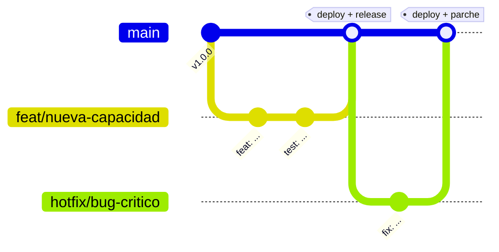

# 02 · SDLC y Git flow — cómo se trabaja cada cambio

> **Plantilla neutral.** Reemplazá `<ASI>` por lo tuyo. Sirve para cualquier hosting/base (ver
> `01-entornos.md`). Objetivo: que cada cambio siga un camino claro de principio a fin y **evitar el
> anti-patrón "todo es hotfix"**.

---

## 1. Modelo de ramas

**`<RAMA_PRODUCCION>` (por defecto `main`) siempre está desplegable** (es lo que hay en producción);
todo lo demás es trabajo en curso en su propia rama corta.

| Rama | Para qué | Nace de | Vuelve a | Va a producción |
|---|---|---|---|---|
| **`<RAMA_PRODUCCION>`** | Código estable, en producción. | — | — | **Sí**, en cada merge |
| **`feat/<slug>`** | Funcionalidad **nueva** (compatible hacia atrás). | `<RAMA_PRODUCCION>` | vía PR | Al mergear |
| **`fix/<slug>`** | Corrección de bug **no urgente**. | `<RAMA_PRODUCCION>` | vía PR | Al mergear |
| **`hotfix/<slug>`** | Corrección **URGENTE** de algo **roto en prod**. | `<RAMA_PRODUCCION>` | vía PR **y** a las ramas en vuelo (§4.1) | Apenas se valida |
| `chore/*`, `docs/*`, `refactor/*` | Tareas menores. | `<RAMA_PRODUCCION>` | vía PR | Al mergear |

**Convención:** el prefijo de la rama = el tipo de Conventional Commit (§3). Una tarea = una rama;
PRs chicos y revisables.

### 1.1. Regla anti-"todo es hotfix"
> **Es `hotfix/*` SOLO si hay algo roto en PRODUCCIÓN que no puede esperar al ciclo normal.** Nace de
> `<RAMA_PRODUCCION>`, se despliega apenas se valida, y **vuelve también a las ramas en vuelo**. Todo
> lo demás es `feat/*` o `fix/*`. Si dudás, **no es hotfix**.

### 1.2. Variante opcional: rama integradora `develop`/`staging`
En equipos más grandes, o si querés una **URL de staging estable**, agregá una rama fija `develop`:
las ramas de trabajo nacen y vuelven a `develop`; `develop` → entorno de testing; cuando hay un
release listo, `develop` se mergea a `<RAMA_PRODUCCION>`. Con equipo chico **no se recomienda** (suma
fricción sin beneficio).

---

## 2. Mapeo a entornos

`<RAMA_PRODUCCION>` → hosting Production + base PROD; ramas de trabajo → Preview + base TESTING; local
→ TESTING. Detalle y el punto delicado de **migraciones que no se despliegan solas** en
`01-entornos.md` §4.

---

## 3. Convención de commits

**Conventional Commits:** `tipo(scope): descripción en imperativo`.

| Tipo | Cuándo |
|---|---|
| `feat` | Funcionalidad nueva |
| `fix` | Corrección de bug |
| `docs` | Solo documentación |
| `refactor` | Reestructura sin cambiar comportamiento |
| `chore` | Mantenimiento (deps, config) |
| `test` | Agregar/ajustar tests |
| `perf` | Mejora de performance |

Ejemplos:
```
feat(<modulo>): agrega <capacidad nueva>
fix(<modulo>): corrige <sintoma> en <caso>
docs(readme): documenta el flujo de <X>
refactor(<capa>): extrae <helper> a módulo dedicado
chore(deps): actualiza <dependencia> a la última menor
release: v<X.Y.Z> — "<nombre del release>"
```
> Un cambio que **rompe** algo o cambia el significado de un dato ya reportado se declara
> (footer `BREAKING CHANGE:` y/o nota en el CHANGELOG).

---

## 4. Pull Requests — revisión y merge

**Qué se valida ANTES de mergear (bloqueante):**
- [ ] `<COMANDO_TYPECHECK>` + `<COMANDO_TESTS>` en verde (+ `<COMANDO_BUILD>` si es UI).
- [ ] Probado en el **preview** de la rama (contra testing) y localmente.
- [ ] Checklist pre-merge de `03-reglas-desarrollo-optimizado.md` §2.
- [ ] `<CHECKLIST_SEGURIDAD_SI_APLICA>` (si toca datos personales / dinero / permisos).
- [ ] Si hay **migración**: aplicada a **prod** (con aprobación) **antes** del merge; tipos regenerados.
- [ ] Si hay **variable nueva**: cargada en los dos scopes del hosting + `.env.local`.

### 4.1. Cómo un hotfix vuelve a todos lados (back-merge)
Un `hotfix/*` corrige prod ya, pero si solo entra a `<RAMA_PRODUCCION>`, el próximo merge de una rama
en vuelo (que salió de una base vieja) **puede revivir el bug**. Por eso:
1. `hotfix/<slug>` → PR → `<RAMA_PRODUCCION>` → deploy a prod.
2. **Inmediatamente**, el fix vuelve hacia atrás: mergear `<RAMA_PRODUCCION>` en `develop` (si existe)
   y en cada rama de trabajo en vuelo (`git merge <RAMA_PRODUCCION>`).

---

## 5. Versionado

**SemVer** (`MAYOR.MENOR.PARCHE`). Fuente de verdad: `CHANGELOG.md`.

| | Cuándo sube |
|---|---|
| **MAYOR** | Cambia **qué significa un dato** que ya se reportó, o rompe un contrato con quien consume el sistema. |
| **MENOR** | Funcionalidad nueva, compatible hacia atrás. |
| **PARCHE** | Corrección de bug o seguridad, sin cambiar significado. |

**Reglas:** la versión **se corta al desplegar a PRODUCCIÓN** (no al mergear); toda migración
pertenece a una versión; un cambio que altera el significado de un dato ya reportado **se declara
explícitamente**. Mantené una sección `[Sin desplegar]` en el CHANGELOG que acumula lo cerrado, y al
desplegar se le pone número/fecha + tag `v<X.Y.Z>`.

---

## 6. Checklist operativo — de principio a fin (sin pensar)

1. **Actualizar:** `git checkout <RAMA_PRODUCCION> && git pull`.
2. **Crear rama:** `git checkout -b feat/<slug>`.
3. **Desarrollar + verificar local** contra testing: `<COMANDO_TYPECHECK>`, `<COMANDO_TESTS>`, build si es UI.
4. **Commits** con Conventional Commits (§3).
5. **Push** → el hosting crea el **Preview** (contra testing). Probar ahí.
6. **Si hay migración:** aplicarla a **testing** primero (`01-entornos.md` §4).
7. **Actualizar `CHANGELOG.md`** sección `[Sin desplegar]`.
8. **PR → `<RAMA_PRODUCCION>`** con el checklist de §4.
9. **Si hay migración:** aplicarla a **PROD** (con aprobación) **antes** del merge; regenerar tipos.
10. **Merge** → deploy a producción.
11. **Cortar versión:** número/fecha en `CHANGELOG.md`, tag `v<X.Y.Z>`, commit `release:`.
12. **Verificar en prod** (humo).
13. **Re-vincular la CLI a testing** para no dejar apuntando a prod.

**Sub-camino hotfix:** rama desde `<RAMA_PRODUCCION>` → fix → verificar → PR → merge → deploy → cortar
**PARCHE** → **back-merge** (§4.1).

---

## 7. Diagrama



---

## Las 5 reglas de oro

1. **`<RAMA_PRODUCCION>` es sagrada: siempre desplegable, siempre = producción.** Nada directo; todo por PR.
2. **Una tarea = una rama corta con nombre que dice qué es** (`feat/`, `fix/`, `hotfix/`). Y **`hotfix` solo si prod está roto**.
3. **Nada llega a prod sin pasar por testing y con aprobación.** Las migraciones se aplican a prod **antes** de mergear el código.
4. **La versión se corta al DESPLEGAR a prod**, se anota en `CHANGELOG.md`, y un cambio que altera el significado de un dato ya reportado **se declara**.
5. **Un hotfix vuelve a todos lados:** después de arreglar prod, back-mergealo a `develop` (si existe) y a las ramas en vuelo.

---

_Plantilla del template `<NOMBRE_PROYECTO>`. Ver `01-entornos.md` y `03-reglas-desarrollo-optimizado.md`._
